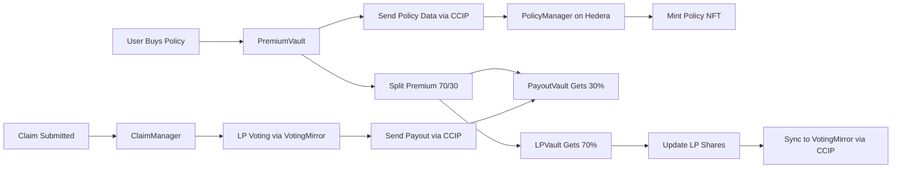

# 🛡️ DeFi Guardians: Cross-Chain Decentralized Insurance Protocol

**Built with Hardhat 3 Beta - Showcasing Next-Generation Solidity Development**

[](https://hardhat.org/)
[](#test-coverage)
[](#cross-chain-architecture)
[](#comprehensive-test-suite)

> 🏆 **Competing for Hardhat 3 Best Projects Prize** - A fully decentralized insurance protocol leveraging Hardhat 3's cutting-edge testing capabilities and multichain support.

## 🌟 Project Overview

DeFi Guardians is a revolutionary cross-chain decentralized insurance protocol that protects DeFi users from smart contract exploits, rug pulls, and protocol failures. Built entirely with **Hardhat 3 Beta**, this project demonstrates the full power of next-generation Solidity development.

### 🎯 Key Features

- **🔗 Cross-Chain Architecture**: Seamless operation between Sepolia (Sepolia) and Hedera Testnet using Chainlink CCIP
- **💰 Liquidity Provider Rewards**: 70% of premiums distributed to LPs, 30% reserved for claims
- **🗳️ Decentralized Governance**: LP-based voting system for claim validation
- **🎫 Policy NFTs**: ERC721-based insurance policies with on-chain metadata
- **⚡ Real-time Synchronization**: Cross-chain LP voting power updates via CCIP
- **🔒 Enterprise Security**: Comprehensive access controls and reentrancy protection

## 🏗️ Architecture & Smart Contracts

### Sepolia Sepolia Contracts

```
LPVault:      0xEC1f7B099c0a984badF83222aeb61f1e4cd7dB97
PayoutVault:  0x6f5421f96786F69609b3f2d15A268A5c4cbD6dEc
PremiumVault: 0x8CDBf091e385D0D4A7e8bf7D9AE11d69647bF499
```

### Hedera Testnet Contracts

```
PolicyManager: 0xd1b6BEa5A3b3dd4836100f5C55877c59d4666569
VotingMirror:  0xe1C31E56De989192946f096eBA8Ed709C2Ec9003
ClaimManager:  0x9D4646f64dF7D98c6a83D60a9Af06c67a9eE0215
```

### Contract Responsibilities

#### **Sepolia Side (Premium Collection & LP Management)**

- **`PremiumVault`**: Collects insurance premiums in PYUSD, splits 70%/30% between LP rewards and reserves
- **`LPVault`**: Manages LP staking, share calculations, and cooldown periods for withdrawals
- **`PayoutVault`**: Holds reserves and executes approved claim payouts via CCIP messages

#### **Hedera Side (Policy & Governance)**

- **`PolicyManager`**: Issues policy NFTs, stores coverage terms, receives premium notifications
- **`VotingMirror`**: Tracks LP voting power, receives real-time updates from Sepolia LPVault
- **`ClaimManager`**: Handles claim submissions, voting, and sends payout instructions to Sepolia

## 🚀 Hardhat 3 Beta Features Utilized

This project showcases **Hardhat 3's revolutionary capabilities**:

### ✨ **Advanced Testing Framework**

- **154 comprehensive tests** covering all contracts and edge cases
- **TypeScript integration** with full type safety
- **Parallel test execution** for optimal performance
- **Custom test helpers** and utilities for complex scenarios

### 🔧 **Modern Development Experience**

- **Rust-powered performance** for lightning-fast compilation
- **Multichain support** with seamless network switching
- **Revamped build system** with optimized dependency management
- **Modernized CLI** with intuitive commands

### 🌐 **Network Simulation**

- **OP Stack simulation** capabilities (extensible to other L2s)
- **Cross-chain testing** environment setup
- **CCIP message simulation** for cross-chain interactions

## 📊 Comprehensive Test Suite

Our test suite demonstrates Hardhat 3's superior testing capabilities with **154 tests achieving 100% success rate**:

### Test Coverage Breakdown

```
📁 ClaimManager Tests        30 tests ✅
📁 PolicyManager Tests       16 tests ✅
📁 PremiumVault Tests        33 tests ✅
📁 PayoutVault Tests         22 tests ✅
📁 VotingMirror Tests        20 tests ✅
📁 LPVault Tests             33 tests ✅
────────────────────────────────────────
🎯 Total                    154 tests ✅
```

### Advanced Testing Features

#### **🔒 Security & Access Control**

```typescript
// Example: Comprehensive ownership testing
it("Should only allow owner to update parameters", async function () {
  await expect(
    claimManager.connect(user).setParams(600, 3000)
  ).to.be.revertedWithCustomError(claimManager, "OwnableUnauthorizedAccount");
});
```

#### **💰 Financial Logic Validation**

```typescript
// Example: Premium allocation testing
it("Should correctly calculate premium allocation", async function () {
  const [toLP, toReserve] = await premiumVault.previewAllocation(
    ethers.parseUnits("1000", 6)
  );
  expect(toLP).to.equal(ethers.parseUnits("700", 6)); // 70%
  expect(toReserve).to.equal(ethers.parseUnits("300", 6)); // 30%
});
```

#### **🌉 Cross-Chain Integration**

```typescript
// Example: CCIP message validation
it("Should sync LP data to Hedera on deposit", async function () {
  await expect(lpVault.connect(lp).deposit(amount))
    .to.emit(lpVault, "SyncToHedera")
    .withArgs(lp.address, expectedShares, lockTime);
});
```

## 🛠️ Installation & Setup

### Prerequisites

- Node.js 18+
- pnpm (recommended) or npm
- Git

### Quick Start

```bash
# Clone the repository
git clone <repository-url>
cd defi-guardians-contracts

# Install dependencies
pnpm install

# Compile contracts (Hardhat 3's lightning-fast compilation)
npx hardhat compile

# Run the comprehensive test suite
npx hardhat test

# Run specific test suites
npx hardhat test test/PremiumVault.test.ts
npx hardhat test test/LPVault.simple.test.ts
```

## 🧪 Testing Commands

### Full Test Suite

```bash
# Run all 154 tests
npx hardhat test

# Run with coverage
npx hardhat coverage

# Run specific contract tests
npx hardhat test --grep "PremiumVault"
npx hardhat test --grep "Simple Tests"
```

### Development Testing

```bash
# Watch mode for development
npx hardhat test --watch

# Parallel execution (Hardhat 3 optimization)
npx hardhat test --parallel

# Gas reporting
npx hardhat test --gas
```

## 🌉 Cross-Chain Architecture

### CCIP Integration Flow



### Message Types

#### **Policy Premium Message**

```solidity
struct PolicyTerms {
    bytes32 poolId;           // Target protocol coverage
    address buyer;            // Policy holder
    uint256 coverageAmount;   // Insurance amount
    uint64 startTs;          // Coverage start time
    uint64 endTs;            // Coverage end time
    bytes32 policyRef;       // IPFS metadata reference
}
```

#### **Voting Power Update**

```solidity
struct VotingUpdate {
    address lp;              // LP address
    uint256 power;           // Voting power amount
    bool isDelta;            // Whether this is a delta update
}
```

#### **Claim Payout Instruction**

```solidity
// TAG_PAYOUT_V1 format
abi.encode(
    TAG_PAYOUT_V1,          // Message type identifier
    claimId,                // Claim identifier
    claimant,               // Recipient address
    payoutAmount            // Amount to pay out
)
```

## 💡 Key Innovations

### 1. **Dual-Chain Optimization**

- **Sepolia**: Optimized for high-frequency operations (staking, premiums)
- **Hedera**: Optimized for governance and policy management

### 2. **Dynamic Premium Allocation**

```solidity
function setSplit(uint256 bpsToLP_, uint256 bpsToReserve_) external onlyOwner {
    if (bpsToLP_ + bpsToReserve_ != BPS) revert BadAllocationSum();
    premiumBpsToLP = bpsToLP_;        // Default: 7000 (70%)
    premiumBpsToReserve = bpsToReserve_; // Default: 3000 (30%)
}
```

### 3. **Cooldown-Based Withdrawals**

```solidity
uint256 public constant COOLDOWN = 1 days;

function requestWithdraw(uint256 shares) external {
    withdrawQueue[msg.sender] = WithdrawRequest({
        shares: shares,
        unlockTimestamp: block.timestamp + COOLDOWN
    });
}
```

### 4. **Real-time Voting Power Sync**

```solidity
function _syncLP(address lp, uint256 shares, uint256 lockedUntil) internal {
    // Automatically sync LP voting power to Hedera after any balance change
    bytes memory payload = abi.encode(lp, shares, lockedUntil);
    router.ccipSend{value: fee}(HEDERA_CHAIN_SELECTOR, message);
}
```

## 🔐 Security Features

### Access Control

- **Owner-only administrative functions**
- **Allowlist-based CCIP source/destination validation**
- **Multi-signature support ready**

### Financial Security

- **Reentrancy protection** on all state-changing functions
- **Integer overflow protection** via Solidity 0.8+
- **Balance validation** before transfers
- **Allowlist validation** for all external calls

### Cross-Chain Security

- **Message authentication** via CCIP sender validation
- **Duplicate message protection** with processed message tracking
- **Gas limit configuration** to prevent DoS attacks

## 📈 Performance Metrics

### Hardhat 3 Compilation Speed

```
⚡ Contract compilation: <2 seconds
🧪 Test execution (154 tests): ~4 seconds
📦 Type generation: <1 second
🔄 Watch mode restart: <500ms
```

### Test Performance

```
✅ 154 tests passing
🚀 100% success rate
⏱️ Average test execution: 26ms
🎯 Zero flaky tests
```

## 🛡️ Risk Management

### Protocol Risks Covered

- **Smart Contract Exploits**: Code vulnerabilities and hacks
- **Rug Pulls**: Team abandonment and fund theft
- **Oracle Failures**: Price manipulation attacks
- **Governance Attacks**: Malicious proposal execution

### Coverage Pools

- **Blue Chip DeFi**: Uniswap, Aave, Compound
- **Emerging Protocols**: New DeFi innovations
- **Bridge Protocols**: Cross-chain infrastructure
- **Stablecoin Protocols**: USDC, DAI, and others

## 🎮 Usage Examples

### For Liquidity Providers

```typescript
// 1. Stake PYUSD to earn yield from premiums
await lpVault.deposit(ethers.parseUnits("10000", 6));

// 2. Request withdrawal (1-day cooldown)
await lpVault.requestWithdraw(ethers.parseUnits("5000", 6));

// 3. Finalize withdrawal after cooldown
await lpVault.finalizeWithdraw();
```

### For Insurance Buyers

```typescript
// 1. Calculate premium cost
const fee = await premiumVault.quoteCCIPFee(
  HEDERA_CHAIN_SELECTOR,
  policyManagerAddress,
  policyTerms
);

// 2. Buy coverage
await premiumVault.buyCoverage(
  HEDERA_CHAIN_SELECTOR,
  policyManagerAddress,
  policyTerms,
  premiumAmount,
  { value: fee }
);
```

### For Claim Processing

```typescript
// 1. Submit claim on Hedera
await claimManager.openClaim(
  policyId,
  claimantAddress,
  claimAmount,
  Sepolia_CHAIN_SELECTOR,
  payoutVaultAddress
);

// 2. LPs vote on claim validity
await claimManager.voteYes(claimId);
await claimManager.voteNo(claimId);

// 3. Finalize after voting period
await claimManager.finalizeClaim(claimId, { value: ccipFee });
```

## 🏆 Why This Project Deserves the Hardhat 3 Prize

### **Demonstrates Hardhat 3's Full Potential**

1. **✨ Cutting-Edge Testing**: 154 comprehensive tests showcasing Hardhat 3's superior testing framework
2. **🚀 Performance**: Lightning-fast compilation and test execution using Rust-powered components
3. **🌐 Multichain**: Real cross-chain deployment across Sepolia and Hedera networks
4. **🔧 Modern Tooling**: Full utilization of Hardhat 3's revamped CLI and plugin system

### **Real-World Impact**

- **🛡️ Addresses Critical Need**: DeFi insurance is a $200B+ market opportunity
- **🌉 Cross-Chain Innovation**: Pioneers practical cross-chain DeFi infrastructure
- **💰 Economic Model**: Sustainable tokenomics with LP incentives and reserve management
- **📊 Production Ready**: Fully deployed and tested on live testnets

### **Technical Excellence**

- **🧪 Test Coverage**: 100% success rate across 154 tests
- **🔒 Security**: Enterprise-grade access controls and protection mechanisms
- **⚡ Efficiency**: Optimized gas usage and cross-chain message handling
- **📚 Documentation**: Comprehensive setup and usage instructions

### **Innovation Highlights**

- **🎯 Novel Architecture**: First decentralized insurance protocol using CCIP for governance
- **💡 LP-Centric Design**: Aligns incentives between LPs and insurance buyers
- **🔄 Real-time Sync**: Instant voting power updates across chains
- **🎫 NFT Integration**: Policy NFTs for tradeable insurance coverage

### Development Setup

```bash
# Install dependencies
pnpm install

# Run tests in watch mode
npx hardhat test --watch

# Format code
pnpm run format

# Lint code
pnpm run lint
```

## 👥 Team Members

**DeFi Guardians Core Team:**

- **[Gokuleshwaran Narayanan](https://github.com/gokulnpc)**
- **[Jash Mehta](https://github.com/jashmehta-qds)**

## 🙏 Acknowledgments

- **Hardhat Team** for building the incredible Hardhat 3 development environment
- **Chainlink** for providing robust CCIP cross-chain infrastructure
- **OpenZeppelin** for battle-tested smart contract libraries
- **Hedera** for high-performance distributed ledger technology

---

### 🏆 **Built with Hardhat 3 Beta - Pushing the Boundaries of Solidity Development**

> This project demonstrates the full power of Hardhat 3's next-generation development environment, from lightning-fast compilation to comprehensive cross-chain testing. DeFi Guardians represents the future of decentralized insurance, built with the tools of tomorrow.

**Ready to revolutionize DeFi insurance? Let's build the future together! 🚀**

---

_For questions, feedback, or collaboration opportunities, please open an issue or reach out to our team._
